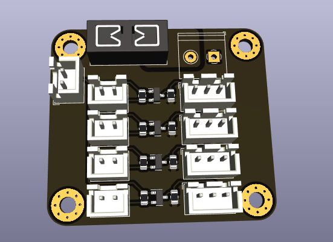

# LED Driver Board (4-gang)

This is a simple LED driver board for 4x 5V neopixel-style LED strips, with level shifters to allow for 3.3V logic.

All of this could probably be soldered-together by hand using an off-the-shelf level shifter PCB and some wires, but
I wanted the convenience of having everything mounted to a single board.

The design also offers a shared fuse for all the LED outputs, which is a nice added benefit.  However, the fuse holder
can be skipped and replaced by a short wire if so desired.
